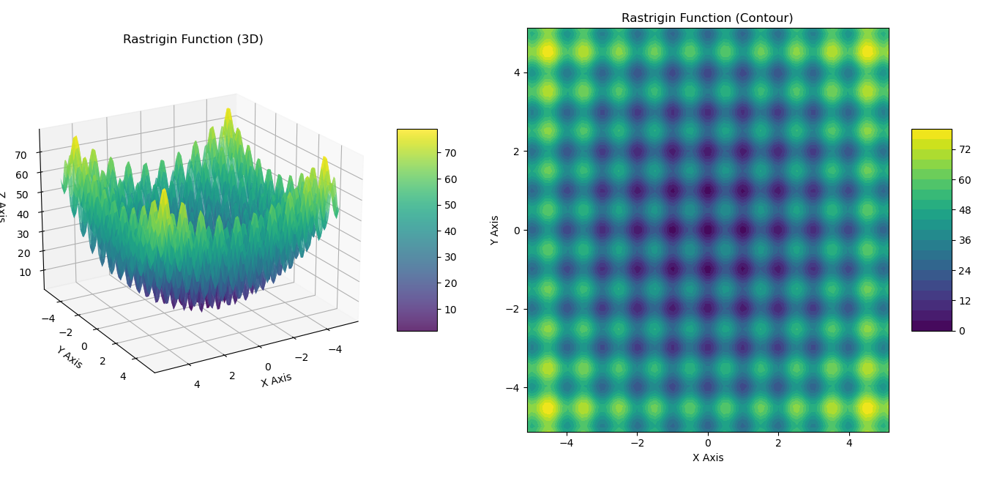

### README.md

# Minimización de la Función de Langermann con Algoritmo Genético

**Autor:** Eliot Fabián Valdés Luis  
**Materia:** Tópicos Selectos de Algoritmos Bioinspirados  
**Carrera:** Ingeniería en Inteligencia Artificial  
**Escuela:** Escuela Superior de Cómputo, IPN

---

## Descripción
Este proyecto implementa un algoritmo genético para minimizar la función de Langermann, una función de prueba utilizada comúnmente en la literatura de algoritmos genéticos. La función de Langermann es una función no lineal y multimodal que se utiliza para evaluar el rendimiento de los algoritmos de optimización en problemas de optimización continua.

El algoritmo genético se compone de los siguientes módulos:
1. **Generación de Población Inicial:** Crea una población inicial de individuos con valores aleatorios para cada gen.
2. **Evaluación de Aptitud:** Evalúa la aptitud de cada individuo de la población según la función de Langermann.
3. **Selección de Padres:** Selecciona a los padres para la reproducción mediante un torneo.
4. **Cruzamiento Binario Simulado (SBX):** Realiza el cruzamiento binario simulado (SBX) para generar nuevos individuos a partir de los padres seleccionados.
5. **Mutación Polinómica:** Aplica la mutación polinómica a los individuos resultantes del cruzamiento.
6. **Sustitución Extentiva por Elitismo:** Reemplaza a los peores individuos de la población n+1 por los mejores individuos de la generación anterior n.

El programa principal combina estos módulos para minimizar la función de Langermann y encontrar el conjunto de parámetros que minimiza la función.

---

## Función de Langermann


La **Función de Langermann** es una función de prueba comúnmente utilizada en problemas de optimización para evaluar el desempeño de algoritmos debido a su naturaleza no lineal y la presencia de múltiples mínimos locales. La función se define como:

&space;=&space;-&space;\sum_{i=1}^{5}&space;c_i&space;\frac{\cos\left(\pi\left[(x_1&space;-&space;a_i)^2&space;+&space;(x_2&space;-&space;b_i)^2\right]\right)}{e^{\left(\frac{(x_1&space;-&space;a_i)^2&space;+&space;(x_2&space;-&space;b_i)^2}{\pi}\right)}})

Donde:
- **\( x_1 \)** y **\( x_2 \)** son las variables de entrada del vector **\( x \)**.
- **\( c_i \)** son constantes específicas de la función para cada término.
- **\( a_i \)** y **\( b_i \)** son constantes para las dimensiones de búsqueda.
- La función incluye una suma de 5 términos con diferentes valores para **\( a \)**, **\( b \)** y **\( c \)**, lo que genera múltiples mínimos locales, dificultando la convergencia del algoritmo hacia el óptimo global.

En este caso, los valores utilizados son:
- **\( a = [3, 5, 2, 1, 7] \)**
- **\( b = [5, 2, 1, 4, 9] \)**
- **\( c = [1, 2, 5, 2, 3] \)**

El objetivo del algoritmo genético es **minimizar** esta función dentro de los límites de búsqueda definidos: **[0, 10]** para ambas variables \( x_1 \) y \( x_2 \).


---

## Contexto
El código está modularizado en diferentes archivos, donde cada uno contiene una función que realiza una tarea específica relacionada con el algoritmo genético. Esta organización facilita la lectura, mantenimiento y reutilización del código para proyectos futuros que involucren algoritmos genéticos.

---

## Justificación
- **Modularización:** El código se ha dividido en módulos individuales para que sea más fácil de entender y mantener. Cada función realiza una tarea específica, lo que permite su reutilización en otros proyectos.
- **Reusabilidad:** Todas las funciones pueden utilizarse de manera independiente, lo que facilita la implementación de nuevos algoritmos genéticos o la mejora de algoritmos anteriores.

---

## Instrucciones de Ejecución

### Requisitos previos
- Python 3.6 o superior
- Biblioteca Numpy

### Instalación de Biblioteca Numpy
Para instalar la biblioteca Numpy, ejecuta el siguiente comando en la terminal:
```bash
pip install numpy
```

### Ejecución de programas de manera independiente
Si deseas probar cada módulo de forma aislada:

1. Ejecuta el archivo correspondiente al módulo que deseas probar.
2. Puedes modificar los parámetros de entrada en los diferentes archivos para experimentar con distintas configuraciones.
3. Cada archivo incluye la validación `if __name__ == "__main__":`, lo que permite ejecutar los módulos de manera independiente sin afectar el funcionamiento del programa general.

### Ejecución del programa general
Si deseas ejecutar el programa general que minimiza la función de Langermann:

1. Ejecuta el archivo `main.py` con el siguiente comando en la terminal:
   ```bash
   python3 main.py
   ```
2. Puedes modificar los parámetros de entrada directamente en el archivo `main.py` para ajustar la configuración del algoritmo genético (tamaño de población, número de generaciones, probabilidades de cruzamiento y mutación, entre otros).
3. Los cambios en `main.py` solo afectarán al programa general y no a los programas individuales.

---

### Archivos incluidos:
- `generate_population.py`: Contiene la función para generar la población inicial.
- `calculate_aptitude.py`: Evalúa la aptitud de los individuos según la función de Langermann.
- `tournament_parent_selection.py`: Selecciona a los padres mediante un torneo.
- `sbx_crossover.py`: Implementa el cruzamiento binario simulado (SBX).
- `polynomial_mutation.py`: Aplica la mutación polinómica a los individuos.
- `main.py`: Ejecuta el programa general que combina todos los módulos para minimizar la función de Langermann.

---

### Contacto
Si tienes alguna duda o sugerencia, no dudes en contactarme:
- **Correo:** eliotvaldes.dev@outlook.com